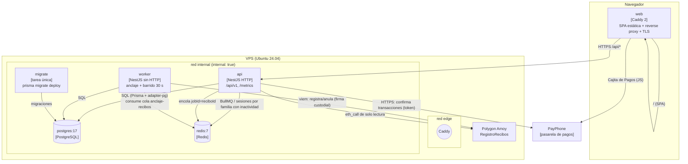

# C4 · Nivel 2: Contenedores

## Responsabilidades

| Contenedor | Responsabilidad                                                                                 | Escala | Clave                                             |
| ---------- | ----------------------------------------------------------------------------------------------- | ------ | ------------------------------------------------- |
| `web`      | Sirve la SPA y redirige `/api/*` al API (mismo origen, sin CORS).                               | 1      | Caddy obtiene el certificado TLS automáticamente. |
| `api`      | API HTTP `/api/v1`, auth JWT, CRUD, `/health`, `/metrics` (solo red interna).                   | 1      | No tiene la clave privada.                        |
| `worker`   | Procesa la cola `anclaje-recibos` (concurrencia 1, 5 intentos, backoff) y el barrido cada 30 s. | 1      | Único contenedor con `OPERATOR_PRIVATE_KEY`.      |
| `migrate`  | Aplica migraciones y termina (`service_completed_successfully`).                                | —      | Arranca antes que api/worker.                     |
| `postgres` | Datos de negocio (Decimal(12,2), UUID, índices).                                                | 1      | Sin puertos publicados.                           |
| `redis`    | BullMQ (Transactional Outbox) + sesiones por familia con inactividad (ADR-016).                 | 1      | `appendonly yes`.                                 |

## Comunicación

- **Frontend → API**: mismo origen (`https://dominio/api/v1`). El refresh token viaja en
  cookie `httpOnly`, `Secure`, `SameSite=Strict` con rotación.
- **API → worker**: no se llaman entre sí; se comunican por la base de datos (outbox) y la
  cola BullMQ (`jobId = reciboId`).
- **worker → cadena**: `simulateContract` + `writeContract` con `maxFeePerGas` acotado;
  `nonceManager` y concurrencia 1 evitan colisiones de nonce.
- **api → cadena**: solo `eth_call` (lectura) para la verificación de recibos, que exige sesión
  (ADR-015).
- **api → PayPhone**: confirma cada transacción de pago en línea con el token de la tienda; el
  SRPP no recibe datos de tarjeta (ADR-014).
