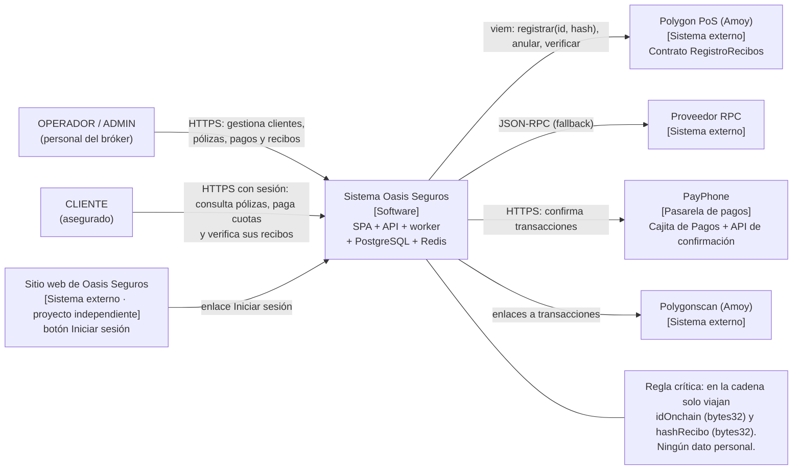

# C4 · Nivel 1: Contexto

Oasis Seguros es un bróker de seguros ecuatoriano. El sistema administrativo gestiona
clientes, pólizas, pagos y recibos verificables en blockchain: cuando un operador valida un
pago, el sistema emite un recibo y ancla su hash en Polygon PoS (testnet Amoy). Solo el
personal de Oasis Seguros y sus clientes usan el sistema, siempre con inicio de sesión; el
cliente verifica sus recibos y paga sus cuotas en línea con PayPhone. Las aseguradoras no son
usuarias: son datos de referencia de las pólizas (ADR-015).

La verificación (`GET /api/v1/recibos/:codigo/verificacion`) hoy es solo del personal; HU-28
(S8) la abre al CLIENTE para sus propios recibos.

## Actores y necesidades

| Actor    | Necesidad                                                                                  |
| -------- | ------------------------------------------------------------------------------------------ |
| ADMIN    | Administrar el sistema, reintentar/anular anclajes, ver métricas.                          |
| OPERADOR | Registrar clientes, pólizas y pagos; validar pagos para emitir recibos; verificar recibos. |
| CLIENTE  | Consultar sus pólizas y pagos, pagar cuotas en línea y verificar sus propios recibos.      |

## Sistemas externos

- **Polygon PoS / Amoy**: red donde vive el contrato inmutable `RegistroRecibos`.
- **Proveedor RPC**: acceso JSON-RPC (con URL de respaldo configurable).
- **Polygonscan Amoy**: explorador de bloques para los enlaces de cada transacción.
- **PayPhone**: pasarela de pagos; la SPA embebe la Cajita de Pagos y el API confirma cada
  transacción (ADR-014).
- **Sitio web de Oasis Seguros**: proyecto independiente; su botón Iniciar sesión dirige a la SPA.
