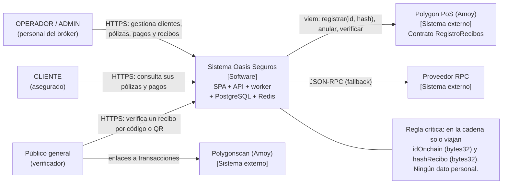

# C4 · Nivel 1: Contexto

Oasis Seguros es un bróker de seguros ecuatoriano. El sistema administrativo gestiona
clientes, pólizas, pagos y **recibos verificables en blockchain**: cuando un operador
valida un pago, el sistema emite un recibo y ancla su hash en **Polygon PoS (testnet
Amoy)**. Cualquier persona puede comprobar un recibo desde una página pública.

## Actores y necesidades

| Actor    | Necesidad                                                               |
| -------- | ----------------------------------------------------------------------- |
| ADMIN    | Administrar el sistema, reintentar/anular anclajes, ver métricas.       |
| OPERADOR | Registrar clientes, pólizas y pagos; validar pagos para emitir recibos. |
| CLIENTE  | Consultar sus pólizas y el estado de sus pagos.                         |
| Público  | Verificar la autenticidad de un recibo sin cuenta ni login.             |

## Sistemas externos

- **Polygon PoS / Amoy**: red donde vive el contrato inmutable `RegistroRecibos`.
- **Proveedor RPC**: acceso JSON-RPC (con URL de respaldo configurable).
- **Polygonscan Amoy**: explorador de bloques para los enlaces públicos.
