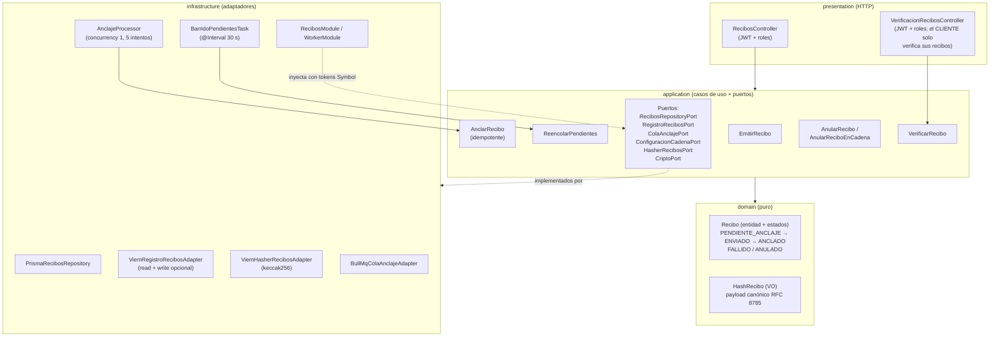

# Componentes del módulo Recibos ("Módulo Blockchain")

El módulo `apps/api/src/modules/recibos` es hexagonal: el dominio es TypeScript puro y
las dependencias externas entran por puertos implementados con adaptadores.

> **Estado (ADR-015):** la verificación exige sesión (`GET /api/v1/recibos/:codigo/verificacion`),
> por ahora solo para el personal; HU-28 (S8) la abre al CLIENTE para sus recibos.

## Puertos e implementaciones

| Puerto (token Symbol) | Adaptador                                                    | Entorno      |
| --------------------- | ------------------------------------------------------------ | ------------ |
| `RECIBOS_REPOSITORY`  | `PrismaRecibosRepository`                                    | api + worker |
| `REGISTRO_RECIBOS`    | `ViemRegistroRecibosAdapter` (sin wallet = solo lectura)     | api          |
| `REGISTRO_RECIBOS`    | mismo adaptador + `WALLET_CLIENT` global                     | worker       |
| `COLA_ANCLAJE`        | `BullMqColaAnclajeAdapter`                                   | api          |
| `CONFIG_CADENA`       | `ConfiguracionCadenaAdapter`                                 | api + worker |
| `HASHER_RECIBOS`      | `ViemHasherRecibosAdapter`                                   | api + worker |
| `CRIPTO`              | `NodeCriptoAdapter` (uuid, código de verificación, sal 32 B) | api + worker |

## Regla de dependencias

`domain` → TypeScript puro · `application` → dominio + puertos · `infrastructure` →
adaptadores (Nest, Prisma, viem, BullMQ) · `presentation` → casos de uso.
`pnpm deps:check` la verifica en CI y `pnpm deps:check:negativo` la comprueba de forma
reproducible: crea un archivo temporal en un `domain/` que importa infraestructura,
confirma que `deps:check` falla y lo elimina (ADR-002).

## Hash del recibo

1. `payload = { codigo, pagoId, numeroPoliza, monto, moneda:"USD", fechaPago, emitidoEn }`
2. `payloadCanonico = canonicalize(payload)` (RFC 8785).
3. `hashRecibo = keccak256(sal ‖ payloadCanonico)`; la sal (32 bytes) **solo** se guarda
   en PostgreSQL.
4. `idOnchain = keccak256(uuid del recibo)`.
