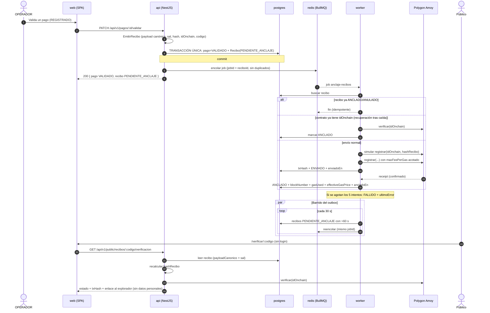

# Secuencia: validación del pago y anclaje del recibo

Patrón **oráculo de salida push-based** + **Transactional Outbox**.

## Idempotencia ante caídas

| Punto de falla                                          | Recuperación                                                                                       |
| ------------------------------------------------------- | -------------------------------------------------------------------------------------------------- |
| API cae tras el commit y antes de encolar               | El barrido de 30 s reencola el recibo que sigue en `PENDIENTE_ANCLAJE` (>60 s).                    |
| Worker cae tras `registrar` y antes de guardar `txHash` | Al reintentar, `verificar(idOnchain)` detecta el registro on-chain y marca `ANCLADO` sin reenviar. |
| Worker cae tras guardar `txHash` y antes del receipt    | Al reintentar, `consultarTransaccion(txHash)` confirma y sincroniza `blockNumber`/`gasUsed`.       |
| Reintento manual (ADMIN) sobre `FALLIDO`                | `POST /api/v1/recibos/:id/reintentar` reencola con el mismo `jobId`.                               |

Evidencia automatizada: `apps/api/test/idempotencia-anclaje.e2e-spec.ts` simula ambos
puntos de falla y verifica que en la cadena exista **un único** evento `ReciboRegistrado`.
